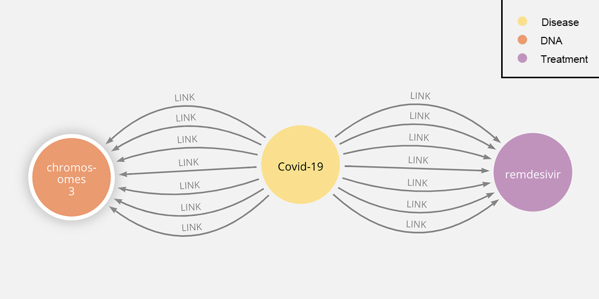

# Biomedical Literature Visualizer 
- [About](#about)
- [Demo](#demo)
- [Usage Guide](#usage-guide)
   - [Entity Recognition](#entity-recognition)
      - [Installation and setup](#installation-and-setup)
      - [Running the script](#running-the-script)
   - [Graphing](#graphing)
      - [Add Nodes](#add-nodes)
      - [Add Relations](#add-relations)
- [Contributors](#contributors)
- [TODO](#todo)

# About
1 in 15 people worldwide are suffering from a rare("orphan") disease. With few doctors knowledgeable about each rare disease, many individuals are unable to receive a diagnosis for their illness. Furthermore, for some rare diseases, there are a limited number of studies that investigate things related to the disease, such as genes associated with the disease. As roughly 2 million research papers are published each year, with estimates that half are unread, the common doctor would be unaware of such studies that could be of use to patients with a rare disease. Our mission is to create a tool that addresses these two issues. <br />
Currently, our solution builds a pipeline that first annotates provided literature with pre-trained NLP models from [Stanza](https://stanfordnlp.github.io/stanza/), a Python natural language analysis package developed by Stanford NLP Group. The models perform entity recognition on the texts that users wish to analyze, labeling entities (biomedical words and phrases) with labels such as DNA, Disease, Organism, etc. Using the labeled entities, our open-source tool adds them to a graph database (currently using [Neo4j](https://neo4j.com/) to visualize), and adds undirected relationships between entities that appear in the same sentence. The more links between two entities, the stronger the connection.

# Demo
## - Overview
We used [a dataset that contains 200,000 papers on Covid-19](https://www.kaggle.com/allen-institute-for-ai/CORD-19-research-challenge) for the demo.

This is a demo graph of 1000 sample entities. Labels are in the top right corner. <br />
Each of the circles in this graph is an annotated entity, a word with a label. For example, {name: Covid-19, label: Disease}. <br />
The link between nodes represents a connection between nodes (how often do two words appear in the same sentence).
## - Relationships

In this example, the tool finds an association between TREATMENT(remdesivir) and DISEASE(Covid-19). As well as a connection between DISEASE(Covid-19) and DNA(chromosomes 3). Interestingly, a recent paper published by Nature, "[The major genetic risk factor for severe COVID-19 is inherited from Neanderthals](https://www.nature.com/articles/s41586-020-2818-3)", conforms this relationship.
# Usage Guide
## - Entity Recognition
### -- Installation and setup
This repository requires Python 3.6 (other versions were not tested).

1. Clone and `cd` into repository via: 

   `git clone https://github.com/Sheldenshi/Visualization-Analyzation-Tool-for-Biomedical-Researchers.git && cd Visualization-Analyzation-Tool-for-Biomedical-Researchers`

2. Create a virtual environment for Python via: 

   `python3 -m venv venv`

3. Activate the virtual environment: 

   `source venv/bin/activate`

4. Install the required packages via: 

   ```bash
   pip install --upgrade pip setuptools
   pip install -r requirements.txt
   ```

5. Download the CORD-19 dataset either manually [here](https://www.kaggle.com/allen-institute-for-ai/CORD-19-research-challenge) or download it via the Kaggle API:

   1. Generate a Kaggle API credentials file via `Create API Token` under the `Account` tab on Kaggle.

   2. Move the `kaggle.json` file to `/home/user/.kaggle/`

   3. For security, change read access rights: 

      `chmod 600 ~/.kaggle/kaggle.json` 

   4. Download the CORD-19 dataset via (21 GB):

      `./download_data.sh`

### -- Running the script

Note: the pretrained models that will be downloaded (specified in `config.yaml`) require about 1 GB of free space.

6a. Execute the following command (adjust the path to the dataset): 

`python main.py --data-dir /path/to/CORD_19_RC/ >> log_1.txt`

6b. Alternatively, you can also run the script in the background via:

`nohup python main.py --data-dir /path/to/CORD_19_RC/ >> log_1.txt &`

You can check if the script is still running by running `htop` or you can check if the script crashed because of an error by opening the log file.
## - Graphing
### -- Add Nodes
### -- Add Relations
# Contributors:
* Shelden Shi
* Tornike Tsereteli
* Isabella Lee-Rubio
# TODO
* Build a live-demo web application.
* Pipeline the tool for easier usage.

The major genetic risk factor for severe COVID-19 is inherited from Neanderthals
